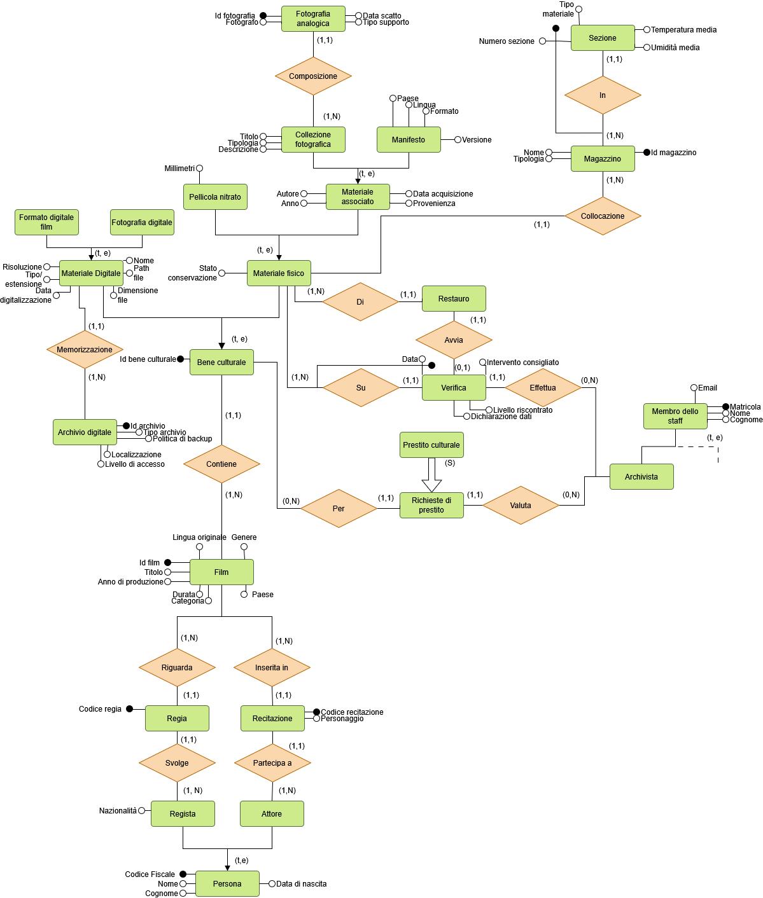
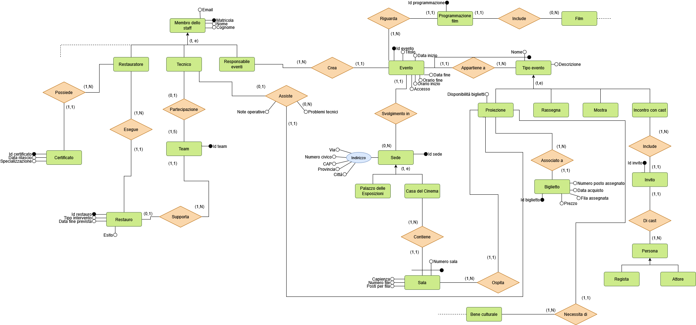
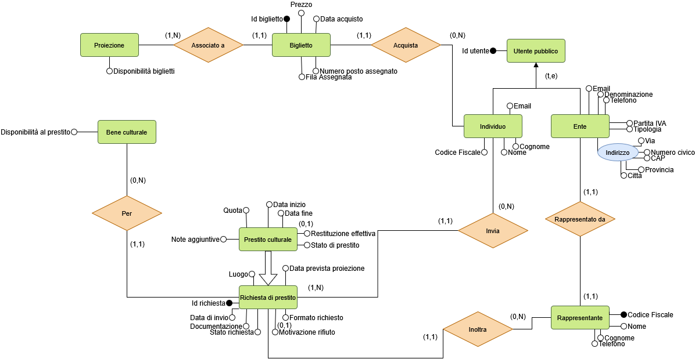
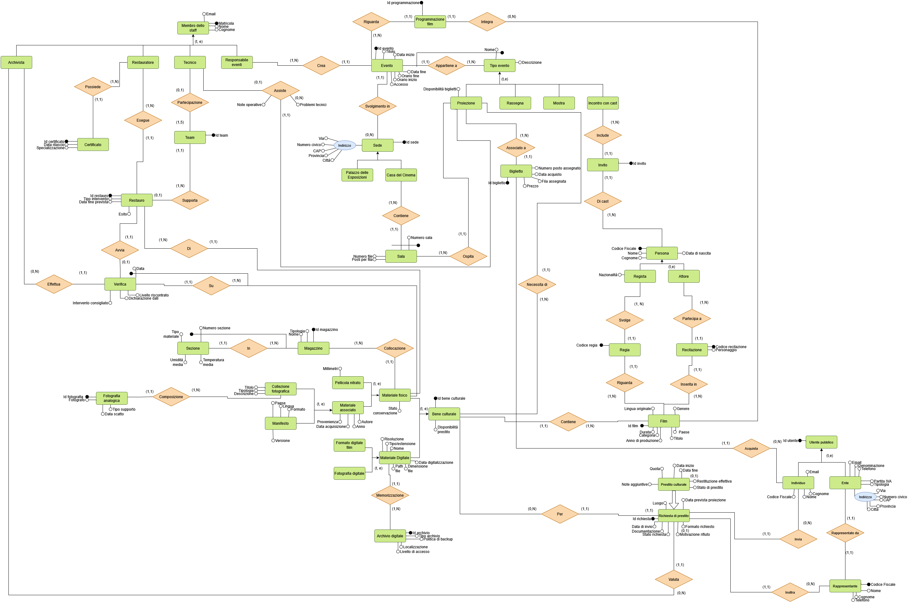

ArchiView è un progetto universitario che comprende la progettazione e l'implementazione di una base di dati per la Cineteca Nazionale, seguendo tutti i passi necessari per un design completo. Il progetto include:
- Analisi dei requisiti
- Glossario dei termini
- Schemi E-R per ciascuna vista e integrazione in uno schema totale
- Ristrutturazione dello schema e traduzione in modello relazionale
- Implementazione in PostgreSQL: schema, trigger, viste, indici e ruoli

**Tecnologie**: PostgresSQL, SQL, LaTeX
 
## Schemi E-R

### Vista Archivista

### Vista Membro dello Staff

### Vista Utente Pubblico

### Schema Totale

 
